# Текущий MVP: задача, ценность и точная архитектура

## 1. Что мы делаем сейчас

Текущий MVP решает задачу:

- **single-channel speech enhancement**
- вход: `1` зашумленный аудиоканал
- выход: `1` очищенный аудиоканал
- целевая речь: **русская речь**
- целевые шумы: бытовые и полуофисные неречевые шумы

Это **не**:

- source separation
- разделение нескольких говорящих
- diarization
- beamforming

Рабочая постановка:

> **noisy Russian speech -> enhanced Russian speech**

## 2. Что мы оптимизируем

### 2.1 Train objective

Модель обучается на парных noisy-clean примерах.

Оптимизируем loss:

```text
L_total = 1.0 * L_waveform + 0.5 * L_log_mag
```

где:

```text
L_waveform = mean(|y_hat - y|)
L_log_mag = mean(|log(1 + |STFT(y_hat)|) - log(1 + |STFT(y)|)|)
```

Обозначения:

- `y_hat` — предсказанный waveform
- `y` — clean target waveform

### 2.2 Что это означает по смыслу

Мы одновременно просим модель:

- восстанавливать clean waveform напрямую
- быть похожей на clean речь по спектральной структуре

### 2.3 Текущая онлайн-метрика в MVP

В ноутбуке и в локальном пайплайне сейчас смотрим:

- `SI-SDR`

Это **техническая MVP-метрика**, чтобы понять, обучается ли модель вообще.

### 2.4 Главная прикладная метрика проекта

Для проекта в целом главная будущая метрика:

- `WER` русского ASR после enhancement

То есть конечная цель проекта не “улучшить звук в среднем”, а:

> сделать так, чтобы после шумоподавления русская речь **лучше распознавалась**

## 3. Почему не просто взять готовую модель

### 3.1 Честный статус на текущем этапе

Сейчас у нас **еще нет доказательства**, что текущая MVP-модель лучше готовых open-source моделей.

Если нужен production-ready denoiser **прямо сегодня**, самый рациональный ход:

- взять готовую модель уровня `DeepFilterNet3`

### 3.2 Зачем тогда мы вообще строим свою модель

Смысл собственной модели появляется только если мы получим выигрыш хотя бы по одному из следующих пунктов:

- лучшее качество **на нашем узком домене**
- меньший размер модели
- меньшая задержка
- лучший `WER` русского ASR
- более предсказуемое поведение под наш шумовой профиль

### 3.3 На чем именно может появиться преимущество

Теоретический источник выигрыша у нашей модели такой:

1. **Узкий домен**
   - мы обучаемся не “на всем подряд”, а на постановке `русская речь + наши типы шумов`

2. **Оптимизация под русскую задачу**
   - готовые модели почти всегда generic
   - они редко оптимизируются именно под downstream `WER` русского ASR

3. **Управляемый компромисс**
   - готовая модель уже выбрала за нас компромисс между latency, качеством, размером и вычислениями
   - своя модель дает возможность двигать этот компромисс в нужную сторону

4. **Малый размер**
   - текущая MVP-сеть очень маленькая
   - это важно как старт для быстрых итераций и возможной дальнейшей легкой deploy-версии

### 3.4 Практический вывод

На текущем этапе корректная формулировка такая:

> мы не пытаемся доказать, что уже сейчас лучше готовых моделей;
> мы строим контролируемый baseline, который можно специализированно дообучать под русский noisy domain и потом честно сравнивать с `DeepFilterNet3`

## 4. Точная текущая архитектура

Текущая модель: [`TinyMaskNet`](/Users/m.pushin/dl/project/src/noise_suppression/modeling.py)

Это **mask-based STFT denoiser**.

Идея:

1. переводим waveform в комплексный спектр через `STFT`
2. из модуля спектра строим признаки
3. маленькая `Conv2d`-сеть предсказывает time-frequency mask
4. этой mask умножаем исходный **комплексный** спектр
5. через `iSTFT` возвращаемся в waveform

### 4.1 Каноническая схема

```mermaid
flowchart LR
    A["Noisy waveform\n[B, T]"] --> B["STFT\ncomplex spectrogram\n[B, F, Tau]"]
    B --> C["Magnitude = abs(spec)\n[B, F, Tau]"]
    C --> D["log1p(magnitude)\n[B, F, Tau]"]
    D --> E["Unsqueeze channel\n[B, 1, F, Tau]"]
    E --> F["Conv2d 1->C, k=3x3, pad=1\nBatchNorm2d\nReLU"]
    F --> G["Conv2d C->C, k=3x3, pad=1\nBatchNorm2d\nReLU"]
    G --> H["Conv2d C->C, k=3x3, pad=1\nBatchNorm2d\nReLU"]
    H --> I["Conv2d C->1, k=1x1\nSigmoid"]
    I --> J["Mask\n[B, F, Tau]"]
    B --> K["Original complex spectrogram\n[B, F, Tau]"]
    J --> L["Elementwise multiply\ncomplex spec * mask"]
    K --> L
    L --> M["Enhanced complex spectrogram"]
    M --> N["iSTFT"]
    N --> O["Enhanced waveform\n[B, T]"]
```



## 5. Послойная спецификация

### 5.1 Текущий runtime-конфиг в Colab

В текущем ноутбуке используется:

- `sample_rate = 16000`
- `segment_seconds = 3.0`
- `n_fft = 512`
- `hop_length = 128`
- `win_length = 512`
- `hidden_channels = 24`

Для сегмента `3.0` секунды:

- входная длина: `T = 48000` samples
- число частотных бинoв после STFT: `F = 257`
- число временных фреймов: `Tau = 376`

### 5.2 Таблица слоев

| Этап | Операция | Входная форма | Выходная форма | Параметры |
|---|---|---:|---:|---|
| 0 | Noisy waveform | `[B, 48000]` | `[B, 48000]` | audio input |
| 1 | `STFT` | `[B, 48000]` | `[B, 257, 376]` complex | `n_fft=512`, `hop=128`, `win=512`, Hann |
| 2 | `abs` | `[B, 257, 376]` | `[B, 257, 376]` | magnitude |
| 3 | `log1p` | `[B, 257, 376]` | `[B, 257, 376]` | feature transform |
| 4 | `unsqueeze(1)` | `[B, 257, 376]` | `[B, 1, 257, 376]` | add channel |
| 5 | `Conv2d` | `[B, 1, 257, 376]` | `[B, 24, 257, 376]` | `1 -> 24`, `3x3`, `pad=1` |
| 6 | `BatchNorm2d` | `[B, 24, 257, 376]` | `[B, 24, 257, 376]` | BN |
| 7 | `ReLU` | `[B, 24, 257, 376]` | `[B, 24, 257, 376]` | activation |
| 8 | `Conv2d` | `[B, 24, 257, 376]` | `[B, 24, 257, 376]` | `24 -> 24`, `3x3`, `pad=1` |
| 9 | `BatchNorm2d` | `[B, 24, 257, 376]` | `[B, 24, 257, 376]` | BN |
| 10 | `ReLU` | `[B, 24, 257, 376]` | `[B, 24, 257, 376]` | activation |
| 11 | `Conv2d` | `[B, 24, 257, 376]` | `[B, 24, 257, 376]` | `24 -> 24`, `3x3`, `pad=1` |
| 12 | `BatchNorm2d` | `[B, 24, 257, 376]` | `[B, 24, 257, 376]` | BN |
| 13 | `ReLU` | `[B, 24, 257, 376]` | `[B, 24, 257, 376]` | activation |
| 14 | `Conv2d` | `[B, 24, 257, 376]` | `[B, 1, 257, 376]` | `24 -> 1`, `1x1` |
| 15 | `Sigmoid` | `[B, 1, 257, 376]` | `[B, 1, 257, 376]` | mask in `[0,1]` |
| 16 | `squeeze(1)` | `[B, 1, 257, 376]` | `[B, 257, 376]` | TF-mask |
| 17 | `spec * mask` | `[B, 257, 376]` | `[B, 257, 376]` complex | complex masking |
| 18 | `iSTFT` | `[B, 257, 376]` complex | `[B, 48000]` | waveform reconstruction |

### 5.3 Размер модели

Для текущего конфига (`hidden_channels = 24`) число обучаемых параметров:

- **10,825 parameters**

Это очень маленькая модель.

## 6. Что взято за основу и что добавлено

### 6.1 Что взято за основу

За основу взят **классический подход спектрального masking-denoiser**:

- `STFT`
- извлечение magnitude-признаков
- предсказание time-frequency mask
- обратное восстановление через `iSTFT`

Это не AlexNet-подобная сеть и не прямой reimplementation конкретной известной paper-модели уровня `DeepFilterNet` или `FullSubNet`.

Это **минимальный кастомный baseline**, специально сделанный для MVP.

### 6.2 Что добавлено поверх “базовой идеи”

Сейчас в архитектуру добавлены только базовые инженерные элементы:

- `BatchNorm2d` после сверточных слоев
- `ReLU`
- `Sigmoid` на выходе для mask
- комбинированный loss: waveform + log-magnitude

### 6.3 Что НЕ добавлено

В текущей версии **нет**:

- attention
- residual blocks
- skip-connections
- LSTM / GRU / Transformer
- complex-valued layers
- phase branch
- multi-resolution STFT loss
- ASR-aware loss
- adversarial / perceptual training

## 7. Почему эта архитектура выбрана сейчас

Причины выбора именно такого baseline:

1. **Очень дешевая в обучении**
   - подходит для быстрого Colab/MVP цикла

2. **Прозрачная**
   - легко понять, что именно модель делает

3. **Хорошо дебажится**
   - если что-то не учится, проще локализовать проблему в data pipeline или loss

4. **Достаточна как стартовый sanity baseline**
   - можно быстро проверить: учится ли вообще denoising на нашем русском synthetic domain

## 8. Где у этой архитектуры границы

Текущая `TinyMaskNet` почти наверняка проиграет сильным современным open-source моделям по абсолютному качеству.

Ее ограничения:

- слишком маленькая емкость
- нет явной работы с phase refinement
- нет long-range temporal modeling
- нет sub-band/full-band decomposition
- нет оптимизации под `WER`

Поэтому корректная роль этой модели:

> **не конечная модель проекта, а обучаемый диагностический baseline**

## 9. Что будет следующим архитектурным шагом

Если текущий пайплайн стабилен, следующий разумный переход:

- оставить текущий data/eval pipeline
- заменить `TinyMaskNet` на **FullSubNet-like / FullSubNet+-lite backbone**
- сравнить с `DeepFilterNet3`

Тогда у нас будет:

- текущий baseline: маленький `STFT + CNN mask`
- practical baseline: `DeepFilterNet3`
- research backbone: `FullSubNet-like`

Это и будет первый честный архитектурный стек для дальнейшей работы.
